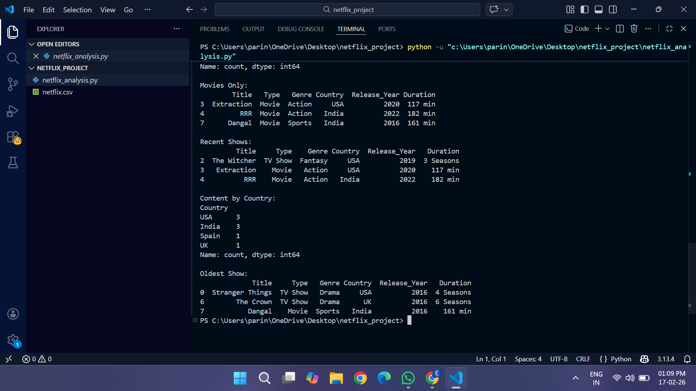

# Netflix-Data-Analysis
Data analysis project using python pandas
# Netflix Data Analysis Project

This project analyzes Netflix dataset using Python and Pandas.

## Features
- Dataset loading using CSV
- Data filtering and analysis
- Finding most popular genres
- Country-wise content analysis

## Tools Used
- Python
- Pandas
- CSV dataset
## Project Output

